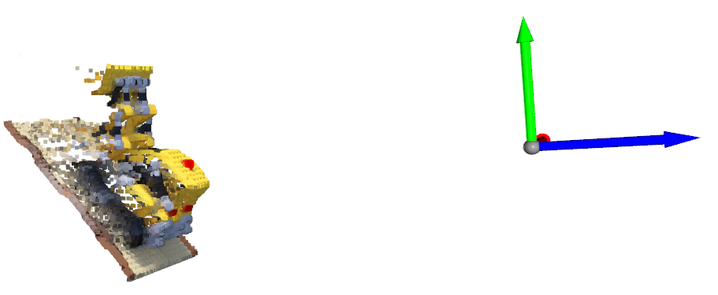
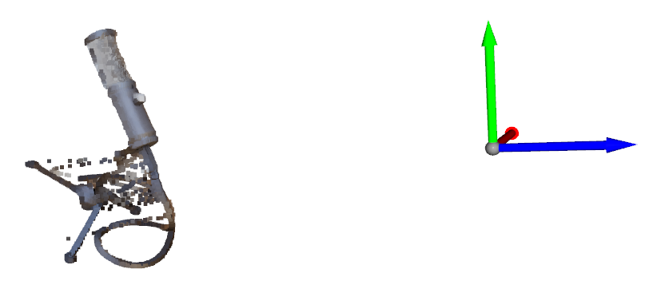
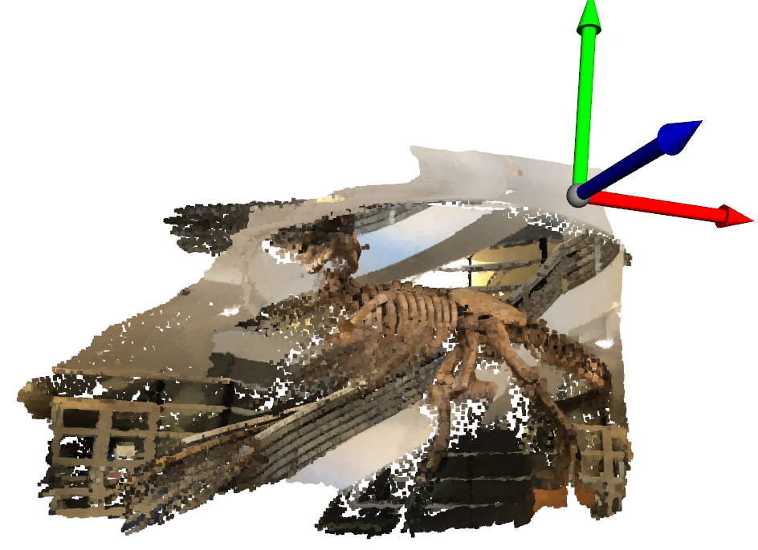

# NeRF-pytorch

Adapted from [NeRF-pytorch](https://github.com/yenchenlin/nerf-pytorch), re-structured for better interpretability and extensibility.


## Train

```shell script
python train_nerf.py config/blender/lego_softplus.yaml --use_wandb
python train_nerf.py config/llff/fern_softplus.yaml --use_wandb
```

## Test

Test PSNR

```shell script
python test_nerf.py config/blender/lego_softplus.yaml --checkpoint 199000
python test_nerf.py config/llff/fern_softplus.yaml --checkpoint 199000
```

Testing results on some scenes (**PSNR**):

| blender            | lego   | ship  | mic   |
|--------------------|--------|-------|-------|
| reported by paper  | 32.54  | 28.65 | 32.91 |
| our implementation | 31.24 | 28.89 | 32.86 |


| blender            | fern  | trex  | horns |
|--------------------|-------|-------|-------|
| reported by paper  | 25.17 | 26.80 | 27.45 |
| our implementation | 26.73 | 27.60 | 28.49 |

Visualize the colored point clouds (RGB & Depth map from volume rendering)

```shell script
python test_nerf_depth.py config/blender/lego_softplus.yaml --checkpoint 199000
python test_nerf_depth.py config/llff/fern_softplus.yaml --checkpoint 199000
```

Examples of visualized point clouds (Coordinate frame denotes the camera, red=x, green=y, blue=z):


